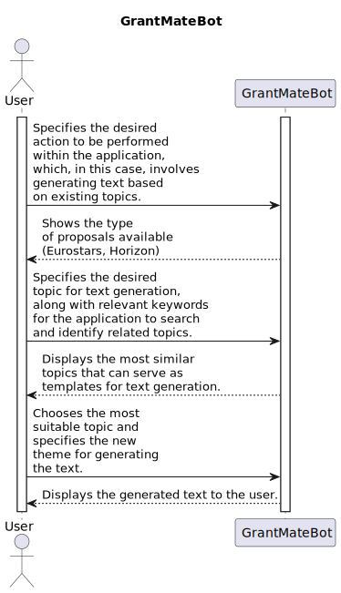

# GrantMateBot

GrantMateBot is a chat bot that serves as an assistant for generating data based on different sections of various project proposals. It can be trained in multiple European proposal types, such as Eurostars and Horizon 2020. The original idea for GrantMateBot was developed at Inova+, where the company specializes in elaborating European project proposals.

## Basic flow of the application

Grant Mate Flow

## Main technical concepts of the application: 

### **AI Bot**

The core of the application is the **AIBot**, developed in Python using libraries such as pandas, PyTorch, spaCy, Flask, HuggingFace Transformers, and the OpenAI API. The AIBot has several responsibilities, including:

* **Extract information from proposals:** The AIBot is equipped with various functionalities to extract topics (such as Abstract, Objectives, State-of-the-art, etc.) from multiple European project proposals. These extracted topics are then saved in a private dataset. To process PDF proposals, the AIBot utilizes PyMuPDF and employs methods like Regex, GROBID (a machine learning model trained on scientific papers), and Parsr (a tool for parsing PDF documents). However, due to the complexity of some documents' structures, these solutions proved to be inefficient, necessitating a somewhat manual extraction process. To address this, different solutions were developed, including a small web app for text extraction using Angular and click events (part of GrantMateUI).
* **Retreive crucial information with semantic search**: By leveraging the dataset of extracted proposals, the AIBot employs SentenceTransformers to generate embeddings of the information (using the msmarco-MiniLM-L-12-v3 model). This allows for semantic search of the various information using FAISS. The objective is to retrieve different topics based on specific keywords, employing the k-nearest neighbors algorithm. For example, if a user searches for "Abstract" with the keywords "Dogs in Portugal," the most similar topic title containing those keywords will be returned.
* **Generate information with LLM:** Building upon the information retrieved through semantic search, users can generate new information. For instance, the most similar "Abstract" previously returned, based on the keywords "Dogs in Portugal," can be used as a template for text generation. The user can then specify a theme for the application to generate text about, such as "Cats in Poland." This text generation utilizes various forms of Prompt Engineering, utilizing the Completions API from OpenAI.

### **GrantMate API**
To handle authentication, chat flow, user data, and other functionalities, an API was developed using Node.js with TypeScript, Sequelize, MySQL, and Docker. The implementation adheres to various software engineering principles and adopts multiple concepts to ensure a robust and maintainable system. Some of the concepts and patterns employed include:
* **Domain-Driven Design (DDD):** The design approach follows DDD principles, which emphasize the importance of clear domain modeling and separation of concerns.
* **Onion Architecture:** The application architecture is based on the Onion Architecture pattern. It promotes a modular and layered structure that allows for easier maintainability and testability.
* **Clean Architecture:** The implementation follows the Clean Architecture principles, focusing on separation of concerns and dependency inversion. This enables decoupling of business logic from external dependencies.
* **Design Patterns:** Various design patterns have been applied, including Dependency Injection, Factories, Strategies, and Builders. These patterns enhance code organization, extensibility, and flexibility.
* **Controller-Service-Repository (CSR):** The architectural concept of CSR has been adopted throughout the implementation. It ensures a clear separation of concerns, with controllers handling HTTP requests (has direct communication with routes), services encapsulating business logic, and repositories managing data access.

The combination of these concepts, patterns, and technologies results in a robust API that provides authentication, manages chat flow, handles user data, and adheres to good software engineering principles.

### **GrantMate UI**
The web app was developed using Angular, following a smart-dumb approach. Angular offers a wide range of techniques and styles that were leveraged during the development process.

The smart-dumb approach, also known as container-presenter or parent-child components, separates the responsibilities of components into two categories: smart components and dumb components. Smart components, also known as container components, handle the logic and state management of the application. Dumb components, also known as presentational components, focus on rendering the UI and receiving inputs from the smart components.

Angular provides a comprehensive set of features and tools that facilitate the development process. It offers a robust framework with built-in support for routing, data binding, dependency injection, and other essential features. Angular's component-based architecture promotes code reusability and maintainability.

Additionally, Angular provides various techniques and styles for implementing components, such as template-driven forms and reactive forms for handling user input, Angular Material for pre-built UI components, and the Angular CLI for efficient project setup and development workflow.

By leveraging Angular's features, techniques, and styles, the web app was developed with a focus on modularity, maintainability, and a rich user interface.

