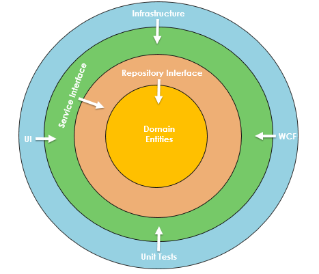
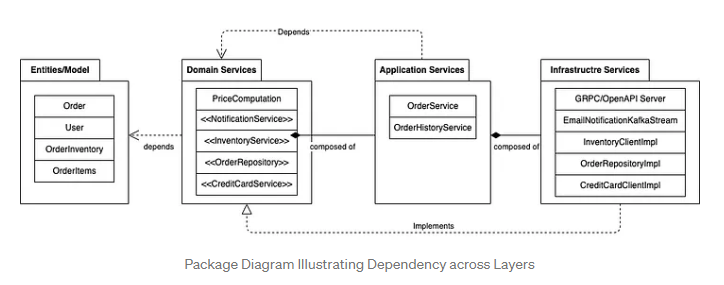

### Arquitetura de Software

#### GrantMateAPI  

##### Domain-Driven Design (DDD)

A principal ideia do DDD é a que o mais importante num software não é o seu código, nem sua arquitetura, nem a tecnologia sobre a qual foi desenvolvido, mas sim o problema que o mesmo se propõe a resolver, ou noutras palavras, as regras de negócio. Neste tipo de design, a estrutura e o código do software (nomes de classes, métodos e variáveis) devem estar de acordo com o domínio de negócio.

Existem 4 princípios chave neste tipo de design:
* **Contexto:** uma palavra ou declaração determina seu significado;
* **Modelo:** um sistema de abstrações que descreve aspectos de um domínio e pode ser usado para resolver problemas relacionados com esse domínio;
* **Linguagem Ubíqua:** linguagem estruturada em torno do modelo de domínio;
* **Contexto limitado:** Uma descrição de um limite dentro do qual um modelo específico é definido e aplicável.

O **DDD** define vários conceitos de alto nível que podem ser usados ​​em conjunto para criar e modificar modelos de domínio:

* **Aggregate:** um cluster de objetos de domínio que podem ser tratados como uma única unidade para fornecer uma funcionalidade específica e para fins de alterações de dados. Um agregado terá um de seus objetos como a Aggregate Root.

* **Aggregate Root:** o único ponto de entrada do domínio para acesso a dados. O trabalho de uma Aggregate Root é controlar e encapsular o acesso aos seus membros de forma a proteger os seus dados. Quaisquer referências de fora do agregado devem ir apenas para a Aggregate Root. A root pode, assim, garantir a integridade do agregado como um todo.

* **Entidade:** é um objeto fundamentalmente definido não pelos seus atributos, mas por um fio de continuidade e identidade. É algo único que tem um ciclo de vida e pode mudar de estado. Um objeto que difere por ID, que deve ser único dentro de um agregado, não necessariamente globalmente. Uma entidade nunca deve ser partilhada entre agregados.

* **Value Object:** é um objeto imutável que descreve alguma característica ou atributo de uma entidade, mas não carrega nenhum conceito de identidade.

* **Service:** essencialmente, um serviço é uma operação ou forma de lógica de negócios que não se encaixa naturalmente em objetos. Noutras palavras, se alguma funcionalidade deve existir, mas não pode ser relacionada a uma entidade ou value object, provavelmente é um serviço.

* **Repositories:** é um serviço que usa uma interface global para fornecer acesso a todas as entidades e value object dentro de uma coleção de agregados específica. Os métodos devem ser definidos para permitir a criação, modificação e exclusão de objetos dentro do agregado. 

##### Onion Architecture

Onion pode ser representado pelas seguintes camadas:

 O Domain-Driven Design centra-se no modelo de domínio que tem uma compreensão rica dos processos e regras de um domínio. A arquitetura Onion implementa esse conceito e aumenta drasticamente a qualidade do código, reduz a complexidade e permite sistemas corporativos evolutivos.

A arquitetura Onion é construída num domínio no qual as camadas se ligam por meio de interfaces. A ideia é manter as dependências externas o mais longe possível, onde as entidades de domínio e as regras de negócios formam a parte central da arquitetura.

Os principais benefícios são:
* fornece arquitetura flexível, sustentável e escalável;
* as camadas não são fortemente acopladas e têm uma separação de interesses;
* fornece melhor manutenção;
* melhora a testabilidade geral do código;
Estruturas/tecnologias podem ser facilmente alteradas sem afetar o domínio principal.

**Princípios:**
É composta por várias camadas concêntricas que se interconectam em direção ao núcleo, que representa o domínio. Baseia-se na inversão do princípio de controlo. A arquitetura não se concentra na tecnologia ou estruturas subjacentes, mas nos modelos de domínio reais. Baseia-se nos seguintes princípios:

* **Dependências:** os círculos representam diferentes níveis de responsabilidade. Geralmente, quanto mais nos aprofundamos, mais nos aproximamos do domínio e das regras de negócio;

* **Encapsulamento de dados:** cada camada/círculo encapsula ou oculta detalhes internos de implementação e expõe uma interface para a camada externa. Todas as camadas também precisam fornecer informações que são convenientemente consumidas pelas camadas internas. O objetivo é minimizar o acoplamento entre as camadas. Geralmente, é utilizada na injeção de dependências para ligar as interfaces à implementação em runtime.

* **Separação de preocupações:** a aplicação é dividida em camadas onde cada um tem um conjunto de responsabilidades e trata de questões separadas.

* **Acoplamento:** baixo acoplamento significa que um módulo interage com outro módulo e não precisa se preocupar com as partes internas do outro módulo. Todas as camadas internas não precisam se preocupar com a implementação interna das camadas externas.

Um exemplo da implementação:

