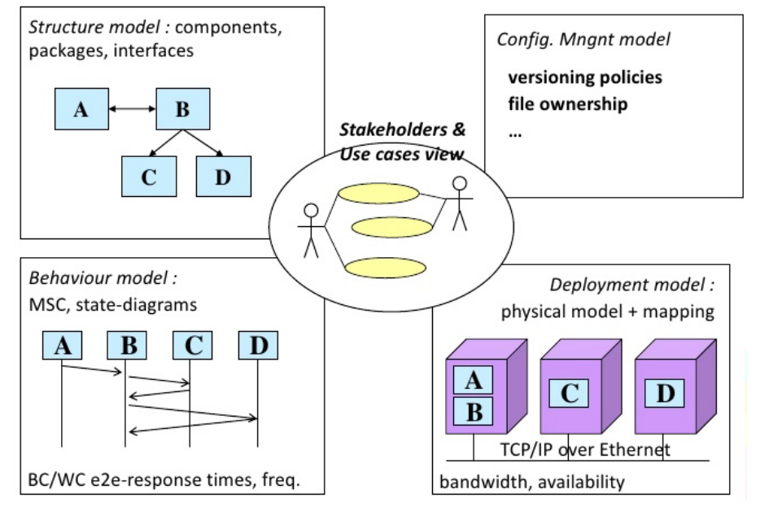

## Modelos de Design

A presente documento pretende destacar quais os modelos de design de software utilizados na arquitetura da aplicação. Tratou-se de uma combinação do Modelo de Vistas 4+1 com o Modelo C4, utilizando a notação UML em todos os diagramas.

#### Modelo de vistas 4+1

O processo geral de design do projeto foi baseado no **modelo de vistas 4+1** que serve para descrever a arquitetura de software baseada no uso de vistas múltiplas e simultâneas. Padroniza o design de software e torna-o fácil de entender por todas as partes interessadas. Ou seja, é expectável que uma pessoa com poucos conhecimentos técnicos consiga perceber as principais interações e conceitos do sistema (https://www.tutorialspoint.com/software_architecture_design/architecture_models.htm).

#### Modelo C4

Contudo, sendo necessário que fosse investigado e analisado com mais detalhe (menor granularidade) a arquitetura da aplicação para os desenvolvedores que implementam/vão implementar o projeto, utilizou-se uma abordagem inspirada no **modelo C4** juntamento ao modelo de vistas 4+1, com a principal missão de "abstração em primeiro lugar" para estruturar a arquitetura de software, com base em abstrações que refletem como os engenheiros de software pensam e constroem o software.
É de destacar que não é de todo obrigatório a utilização extensiva dos 4 níveis existentes do modelo. Apenas devem ser elaborados diagramas com as vistas que agregavam valor à arquitetura e design do software (https://c4model.com/). Tratou-se de uma adaptação do modelo apenas para dar uma designação ao tipo de design adotado, uma vez que ao longo dos diferentes diagramas é possível identificar diferentes nível de abstração e de granularidade. Este tipo de diagramas por normal não segue uma notação UML, contudo, este tipo de notação foi o único utilizado ao longo do design de software.
